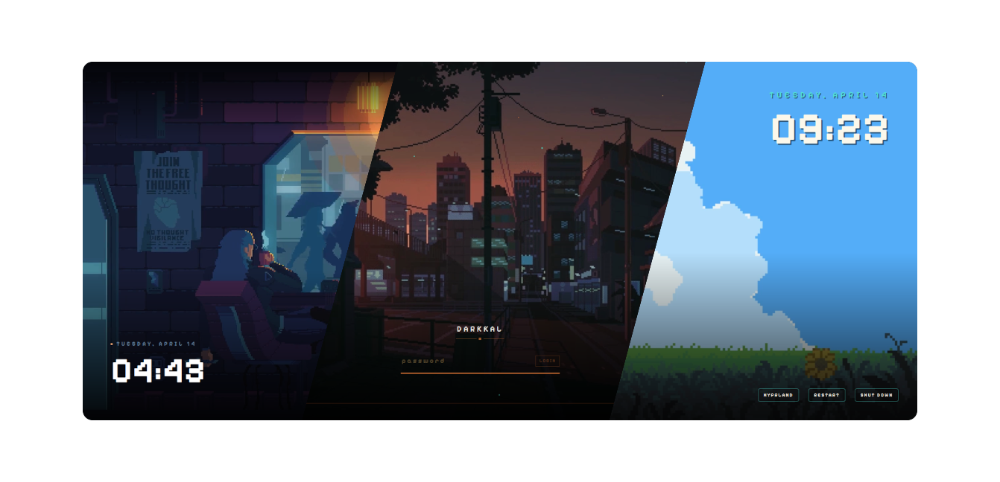

<p align="center">
  
</p>

<p align="center">
  <a href="#sddm"></a>&nbsp;<a href="#usage"></a>&nbsp;<a href="#installation"></a>&nbsp;<a href="#architecture"></a>&nbsp;<a href="#license"></a>
</p>

<div align="center">
<pre>
<a href="#features">ꜰᴇᴀᴛᴜʀᴇꜱ</a>  •  <a href="#installation">ɪɴꜱᴛᴀʟʟ</a>  •  <a href="#usage">ᴜꜱᴀɢᴇ</a>  •  <a href="#configuration">ᴄᴏɴꜰɪɢ</a>  •  <a href="#preview">ᴘʀᴇᴠɪᴇᴡ</a>  •  <a href="#sddm">ꜱᴅᴅᴍ</a>  •  <a href="#faq">ꜰᴀǫ</a>  •  <a href="#gallery">ɢᴀʟʟᴇʀʏ</a>  •  <a href="#acknowledgements">ᴀᴄᴋɴᴏᴡʟᴇᴅɢᴇᴍᴇɴᴛꜱ</a>
</pre>
</div>

<br>

<p align="center">
  
</p>

<p>Welcome to <b>Darwan</b>! It's one app, with a CLI, a TUI and a GUI, for choosing, configuring, previewing and applying a collection of hand-crafted themes to both of your gates:</p>

- **the login screen**, through SDDM
- **the lockscreen**, through Quickshell

> [!NOTE]
> **What's in the name?**
> **Darwan** (দারোয়ান, said *dar-waan*) is Bangla for *gatekeeper*: the guard who sits by the gate, checks who's coming in and politely sends everyone else away. This app does that job at both of your computer's gates.

> [!WARNING]
> Darwan is under active development. This README describes the app as it is being built, so some commands are not available yet. Until the first release, the legacy `sddm.sh` and `quickshell.sh` scripts in this repository still work.

<br>
<p align="center">━━━━━━━ ❖ ━━━━━━━</p>

<a id="features"></a>
<br>

<p align="center">
  
</p>

<br>

- **One app, three faces.** `darwan` (CLI), `darwan` with no arguments (TUI) and `darwan-gui` (a Qt GUI) all share the same core, so they behave identically.
- **One config file.** `~/.config/darwan/config.toml` holds everything. Nothing inside the theme folders is ever edited.
- **Separate lockscreen and login themes.** Use Orbital for the lock and Rainy Room for SDDM if you like.
- **Options that know the theme.** Each theme declares what it supports. Options a theme can't use are shown disabled with the reason, and options that depend on another option unlock when it's set.
- **Test without locking yourself out.** Get a live preview in the GUI, open a windowed preview with a fake password, preview through SDDM's own greeter, or run headless checks across every theme.
- **Safe SDDM setup.** A tiny, audited helper does the root-only work through polkit, and nothing else runs as root.
- **Never locked out.** If a theme fails to load, Darwan shows a plain fallback password prompt instead of a black screen.
- **Global settings.** 12h/24h clock and date format apply to every theme that supports them.

<br>
<p align="center">━━━━━━━ ❖ ━━━━━━━</p>

<a id="installation"></a>
<br>

<p align="center">
  
</p>

<br>

> [!NOTE]
> Darwan supports **Arch Linux only**, with Qt6 SDDM and Quickshell on Wayland.

#### 📦 DEPENDENCIES

| | Packages |
|--:|:---|
| **Core** | `quickshell` `qt6-declarative` `qt6-5compat` `qt6-svg` |
| **Video themes** | `qt6-multimedia` `qt6-multimedia-ffmpeg` `gst-plugins-base` `gst-plugins-good` `gst-plugins-bad` `gst-plugins-ugly` |
| **Login screen** | `sddm` `polkit` |
| **Optional** | `libfaketime` (preview at a chosen time of day) |

#### 🚀 BUILD & INSTALL

From a checkout of this repository:

```sh
cd packaging/arch && makepkg -si
```

The package installs:

| Path | What |
|:---|:---|
| `/usr/bin/darwan` | CLI + TUI |
| `/usr/bin/darwan-gui` | GUI |
| `/usr/lib/darwan/darwan-helper` | privileged SDDM helper (run through `pkexec`) |
| `/usr/share/darwan/runtime/` | the QML runtime shared by the lockscreen and previews |
| `/usr/share/darwan/themes/` | all themes |

#### 🧪 RUN FROM SOURCE (DEVELOPMENT)

```sh
DARWAN_DATA_DIR=$PWD cargo run -p darwan -- preview nier-automata
DARWAN_DATA_DIR=$PWD cargo run -p darwan-gui
```

`DARWAN_DATA_DIR` points every binary at `./runtime` and `./themes`, so nothing needs installing.

<br>
<p align="center">━━━━━━━ ❖ ━━━━━━━</p>

<a id="usage"></a>
<br>

<p align="center">
  
</p>

<br>

#### ⌨️ CLI

| Command | What it does |
|:---|:---|
| `darwan` | open the TUI |
| `darwan list` | list installed themes |
| `darwan show <theme>` | show a theme's options, defaults and what it supports |
| `darwan get <key>` / `darwan set <key> <value>` | read or change a setting, e.g. `darwan set clock.format 12h` |
| `darwan lock [theme]` | lock the screen now |
| `darwan preview <theme>` | windowed preview, no real lock ([details](#preview)) |
| `darwan check [--all]` | headless load test of one or all themes |
| `darwan sddm apply` / `preview` / `status` / `reset` | manage the login screen ([details](#sddm)) |
| `darwan doctor` | find missing packages, fonts and conflicting SDDM config |

#### 🖥️ TUI

Run `darwan` in a terminal. You get:
- a theme list with an animated preview (kitty/sixel, falling back to block characters)
- an options form generated for the selected theme

| Key | Action |
|:---|:---|
| `Enter` | edit the selected theme's options |
| `p` | open a windowed preview |
| `a` | apply to the lockscreen |
| `s` | apply to SDDM (asks for your password through polkit) |

#### 🎨 GUI

Run `darwan-gui`. The window has three panes:

| Left | Centre | Right |
|:---|:---|:---|
| theme gallery | live preview that updates as you change options | the selected theme's options |

The buttons are *Apply to lockscreen*, *Apply to SDDM*, *Full preview* and *SDDM preview*.

#### 🔒 LOCKSCREEN KEYBIND

Point your window manager's lock keybind at `darwan lock`. For example, in Hyprland:

```ini
bind = SUPER, L, exec, darwan lock
```

Pressing the keybind while already locked does nothing, because only one lockscreen runs at a time.

<br>
<p align="center">━━━━━━━ ❖ ━━━━━━━</p>

<a id="configuration"></a>
<br>

<p align="center">
  
</p>

<br>

Everything lives in `~/.config/darwan/config.toml`. The CLI, TUI and GUI all edit this file and keep your comments. You can also edit it by hand.

```toml
[lock]
theme = "clockwork/orbital"

[sddm]
theme = "pixel-rainyroom"

[clock]
format = "12h"          # "12h" | "24h"
show_ampm = false

[date]
format = ""             # "" keeps the theme's own style, or a Qt date format like "dddd, MMMM d"

[themes."clockwork/orbital"]
themeMode = "light"
enableWindup = false

[themes.terraria]
background_mode = "static"
background_index = "3"
```

#### 🎛️ PER-THEME OPTIONS

| Theme | Option | Values |
|:---|:---|:---|
| Clockwork · Orbital | `themeMode` | `dark` `light` |
| Clockwork · Orbital | `enableWindup` | `true` `false` |
| Clockwork · Tape | `themeMode` | `dark` `light` |
| osu! / osu! mania | `gameMode` | `menu` (straight to password) · `game` (rhythm-game gate) |
| Genshin Impact | `background_mode` · `background_index` | `time` `random` `static` · `1`–`4` (day, night, dawn, dusk) |
| Terraria | `background_mode` · `background_index` | `time` `random` `static` · `1`–`5` |

`darwan show <theme>` always lists the current set. The global `clock` and `date` settings apply only to themes that support them. Everywhere else they are shown as disabled.

#### 🔤 FONTS

Some themes use fonts that can't be bundled for copyright reasons. Get the font, then use *Import font…* in the GUI or TUI, or drop the file into the theme's `font/` folder.

| Theme | Font | Filename | Licence | Get it |
|--:|:---|:---|:---|:---|
| NieR: Automata | FOT-Rodin Pro DB | `FOT-Rodin Pro DB.otf` | Commercial (Fontworks) | [Adobe Fonts](https://fonts.adobe.com/fonts/fot-rodin-pron) |
| Terraria | Andy Bold | `Andy Bold.ttf` | Commercial (Monotype) | [MyFonts](https://www.myfonts.com/collections/andy-font-matteson-typographics/) |
| Genshin Impact | HYWenHei-85W | `zhcn.ttf` | Commercial (Hanyi) | [Hanyi](https://www.hanyi.com.cn/) |
| Sword | The Last Shuriken | `The Last Shuriken.ttf` | Free for personal use | [DaFont](https://www.dafont.com/the-last-shuriken.font) |
| Honkai: Star Rail | DIN Next | `font.ttf` | Commercial (Monotype) | — |
| osu! | Torus Regular | `Torus Regular.otf` | Commercial (Paulo Goode) | [Paulo Goode](https://paulogoode.com/torus/) |
| Nothing | NDot 55 | `NDot55.otf` | Nothing brand use only | No public release |

<br>
<p align="center">━━━━━━━ ❖ ━━━━━━━</p>

<a id="preview"></a>
<br>

<p align="center">
  
</p>

<br>

You never have to lock your real session to try a theme.

| Mode | How | Password | Good for |
|:---|:---|:---|:---|
| **Live preview** | GUI centre pane | `test` | tweaking options and seeing the change instantly |
| **Windowed preview** | `darwan preview <theme>` | `test` (or real with `--auth pam`) | the exact lockscreen runtime in a window |
| **SDDM preview** | `darwan sddm preview <theme>` | — (visual only) | checking how it looks on the login screen before applying |
| **Headless check** | `darwan check --all --shots ./shots` | — | catching QML errors across every theme; saves screenshots |

Useful preview flags:

```sh
darwan preview clockwork/orbital --size 2560x1440
darwan preview Genshin --at 18:30        # fake the time of day (needs libfaketime)
darwan preview nier-automata --at 00:00  # check 12h vs 24h at midnight
```

<br>
<p align="center">━━━━━━━ ❖ ━━━━━━━</p>

<a id="sddm"></a>
<br>

<p align="center">
  
</p>

<br>

```sh
darwan sddm apply     # apply [sddm] theme + options (asks for your password via polkit)
darwan sddm status    # show what SDDM will use and any conflicts
darwan sddm reset     # remove everything Darwan added
```

The SDDM greeter runs as its own user and can't read your home folder, so `apply` writes system files through `darwan-helper`. The helper checks every value again before writing, and it only ever touches these files:

| File | Purpose |
|:---|:---|
| `/usr/share/sddm/themes/darwan` | points at the chosen theme |
| `/usr/share/darwan/themes/<theme>/theme.conf.user` | your options, in SDDM's own override format |
| `/etc/sddm.conf.d/zz-darwan.conf` | `[Theme] Current=darwan` |

> [!TIP]
> SDDM reads `/etc/sddm.conf.d/` in alphabetical order, and later files win. If another file or `/etc/sddm.conf` also sets `Current=`, `darwan doctor` will point it out.

<br>
<p align="center">━━━━━━━ ❖ ━━━━━━━</p>

<a id="architecture"></a>
<br>

<p align="center">
  
</p>

<br>

```
crates/darwan-core     Rust library: themes, config, validation, SDDM plan (no Qt)
crates/darwan          CLI + TUI (clap, ratatui)
crates/darwan-gui      GUI (cxx-qt + QML), also runs headless checks
crates/darwan-helper   root-only SDDM writer, launched through pkexec
runtime/               QML: ThemeHost, SDDM-compatible contract, Quickshell lock shell
themes/<id>/           Main.qml, theme.conf, metadata.desktop, darwan.toml
```

- **Themes stay plain SDDM themes.** They read `config.<key>` exactly as they would under SDDM.
- **One override file for both runtimes.** Darwan resolves your settings into that override format, so the lockscreen and the login screen see the same values.
- **Themes describe themselves.** Each theme's `darwan.toml` lists its options: labels, types, choices and what it depends on. The TUI and GUI build their forms from it.

<br>
<p align="center">━━━━━━━ ◈ ━━━━━━━</p>

<a id="faq"></a>
<br>

<p align="center">
  
</p>

<br>

#### 🔓 A theme broke and I'm stuck on the lockscreen?
Darwan should show its fallback password prompt. If the screen is ever unresponsive, switch to a TTY (`Ctrl+Alt+F3`), log in, and run `loginctl unlock-session`. Then run `darwan check <theme>` and open an issue with the output.

<br>

#### ⌨️ Virtual keyboard popping up on the login screen?
Open `/etc/sddm.conf.d/virtualkeyboard.conf` as root and empty `InputMethod`:

```ini
[General]
InputMethod=
```

<br>

#### 📺 Low quality background video?
Videos are compressed to keep the download small. For the full HD/4K version, grab the original from the [Acknowledgements](#acknowledgements) table, rename it to `bg.mp4` and replace the one in the theme's folder.

<br>

#### ❄️ Lockscreen not working on KDE Plasma?
KWin doesn't support the `ext-session-lock-v1` protocol that the Quickshell lockscreen needs. The SDDM login screen still works fine on Plasma.

<br>

<p align="center">━━━━━━━ ❖ ━━━━━━━</p>

<a id="gallery"></a>
<br>
<p align="center">

</p>
<br>
<div align="center">
<table style="border-collapse: collapse; border: none;">
<tr>
<td align="center" width="50%" style="padding: 15px; border: none;">
<b>Pixel · Coffee</b><br><br>

</td>
<td align="center" width="50%" style="padding: 15px; border: none;">
<b>Pixel · Dusk City</b><br><br>

</td>
</tr>
<tr>
<td align="center" width="50%" style="padding: 15px; border: none;">
<b>Pixel · Hollow Knight</b><br><br>

</td>
<td align="center" width="50%" style="padding: 15px; border: none;">
<b>Pixel · Munchlax</b><br><br>

</td>
</tr>
<tr>
<td align="center" width="50%" style="padding: 15px; border: none;">
<b>Pixel · Night City</b><br><br>

</td>
<td align="center" width="50%" style="padding: 15px; border: none;">
<b>Pixel · Rainy Room</b><br><br>

</td>
</tr>
<tr>
<td align="center" width="50%" style="padding: 15px; border: none;">
<b>Pixel · Skyscrapers</b><br><br>

</td>
<td align="center" width="50%" style="padding: 15px; border: none;">
<b>Pixel · Cyberpunk</b><br><br>

</td>
</tr>
<tr>
<td align="center" width="50%" style="padding: 15px; border: none;">
<b>Pixel · Emerald</b><br><br>

</td>
<td align="center" width="50%" style="padding: 15px; border: none;">
<b>Pixel · Sakura</b><br><br>

</td>
</tr>
<tr>
<td align="center" width="50%" style="padding: 15px; border: none;">
<b>Pixel · Waterfall</b><br><br>

</td>
<td align="center" width="50%" style="padding: 15px; border: none;">
<b>Enfield</b><br><br>

</td>
</tr>
<tr>
<td align="center" width="50%" style="padding: 15px; border: none;">
<b>Sword</b><br><br>

</td>
<td align="center" width="50%" style="padding: 15px; border: none;">
<b>Forest</b><br><br>

</td>
</tr>
<tr>
<td align="center" width="50%" style="padding: 15px; border: none;">
<b>Winter</b><br><br>

</td>
<td align="center" width="50%" style="padding: 15px; border: none;">
<b>Dog Samurai</b><br><br>

</td>
</tr>
<tr>
<td align="center" width="50%" style="padding: 15px; border: none;">
<b>The Last of Us</b><br><br>

</td>
<td align="center" width="50%" style="padding: 15px; border: none;">
<b>Field</b><br><br>

</td>
</tr>
<tr>
<td align="center" width="50%" style="padding: 15px; border: none;">
<b>Girl · Coffee</b><br><br>

</td>
<td align="center" width="50%" style="padding: 15px; border: none;">
<b>Girl · Pillow</b><br><br>

</td>
</tr>
<tr>
<td align="center" width="50%" style="padding: 15px; border: none;">
<b>Man · Bicycle</b><br><br>

</td>
<td align="center" width="50%" style="padding: 15px; border: none;">
<b>Women · Umbrella</b><br><br>

</td>
</tr>
<tr>
<td align="center" width="50%" style="padding: 15px; border: none;">
<b>Nothing</b><br><br>

</td>
<td align="center" width="50%" style="padding: 15px; border: none;">
<b>Material You</b><br><br>

</td>
</tr>
<tr>
<td align="center" width="50%" style="padding: 15px; border: none;">
<b>Honkai: Star Rail</b><br><br>

</td>
<td align="center" width="50%" style="padding: 15px; border: none;">
<b>Genshin Impact</b><br><br>

</td>
</tr>
<tr>
<td align="center" width="50%" style="padding: 15px; border: none;">
<b>Wuthering Waves</b><br><br>

</td>
<td align="center" width="50%" style="padding: 15px; border: none;">
<b>osu!</b><br><br>

</td>
</tr>
<tr>
<td align="center" width="50%" style="padding: 15px; border: none;">
<b>osu! mania</b><br><br>

</td>
<td align="center" width="50%" style="padding: 15px; border: none;">
<b>Minecraft</b><br><br>

</td>
</tr>
<tr>
<td align="center" width="50%" style="padding: 15px; border: none;">
<b>NieR: Automata</b><br><br>

</td>
<td align="center" width="50%" style="padding: 15px; border: none;">
<b>Reverse: 1999 - I</b><br><br>

</td>
</tr>
<tr>
<td align="center" width="50%" style="padding: 15px; border: none;">
<b>Reverse: 1999 - II</b><br><br>

</td>
<td align="center" width="50%" style="padding: 15px; border: none;">
<b>Clockwork</b><br><br>

</td>
</tr>
<tr>
<td align="center" width="50%" style="padding: 15px; border: none;">
<b>Terraria</b><br><br>

</td>
<td align="center" width="50%" style="padding: 15px; border: none;">
<b>Ninja Gaiden</b><br><br>

</td>
</tr>
<tr>
<td align="center" width="50%" style="padding: 15px; border: none;">
<b>Windows 7</b><br><br>

</td>
<td align="center" width="50%" style="padding: 15px; border: none;">
<b>Material You Dark</b><br><br>

</td>
</td>
</tr>
</table>
</div>

<br>

<p align="center">━━━━━━━ ❖ ━━━━━━━</p>

<a id="acknowledgements"></a>
<br>

<p align="center">
  
</p>

<br>

> [!IMPORTANT]
> ### 💜 Built on qylock
> Darwan would not exist without **[qylock](https://github.com/Darkkal44/qylock)** by **[Darkkal44](https://github.com/Darkkal44)**.
>
> Every theme in this collection was designed and built there: the pixel worlds, the game tributes, Clockwork, and the SDDM/Quickshell shim that made one theme run in both places. Darwan only builds an app around that work. The hard, creative part is theirs.
>
> Thank you, Darkkal, and thank you to everyone who helped qylock grow:
> - the contributors
> - supporters **Max**, **Awkward**, **Chương Kính**, **MerhawiGhebrekal**, **Silenett**, **wawzi**, **franchecol** and **Trench Martyr**
> - special thanks to **Pumphium**, **kaizky** and **DragonChicken**
>
> If you enjoy these themes, please ⭐ [star qylock](https://github.com/Darkkal44/qylock) and [support Darkkal on Ko-fi](https://ko-fi.com/darkkal).

<p align="center">
  <a href="https://ko-fi.com/darkkal">
    
  </a>
</p>

<br>

Huge thanks to all the amazing artists for these wallpapers and fonts! Here's where everything comes from:

| Theme | Wallpaper | Font | Theme | Wallpaper | Font |
|:---|:---|:---|:---|:---|:---|
| **Pixel · Coffee** | [MoeWalls](https://moewalls.com/pixel-art/cyberpunk-coffee-pixel-live-wallpaper/) | Pixelify Sans | **Pixel · Munchlax** | [MoeWalls](https://moewalls.com/pixel-art/munchlax-sleeping-on-the-field-pixel-live-wallpaper/) | Pixelify Sans |
| **Pixel · Dusk City** | [WallsFlow](https://wallsflow.com/live-wallpapers/pixel-art/505-pixel-dusk-city-retro-anime-streets-live-wallpaper.html) | Pixelify Sans | **Pixel · Night City** | [WallsFlow](https://wallsflow.com/live-wallpapers/pixel-art/400-night-city-pixel-art-cyberpunk-live-wallpaper.html) | Pixelify Sans |
| **Pixel · Hollow Knight** | [MoeWalls](https://moewalls.com/pixel-art/hollow-knight-3-live-wallpaper/) | Pixelify Sans | **Pixel · Rainy Room** | [MoeWalls](https://moewalls.com/pixel-art/pixel-room-rainy-night-live-wallpaper/) | Pixelify Sans |
| **Pixel · Skyscrapers** | [WallsFlow](https://wallsflow.com/live-wallpapers/pixel-art/61-pixel-city.html) | Pixelify Sans | **Pixel · Cyberpunk** | [Pixiv](https://www.pixiv.net/en/artworks/84120766) | Pixelify Sans |
| **Pixel · Emerald** | - | Pixelify Sans | **Pixel · Sakura** | - | Pixelify Sans |
| **Pixel · Waterfall** | - | Pixelify Sans | **Enfield** | [WallsFlow](https://wallsflow.com/live-wallpapers/games/777-arknights-endfield-sakura-sanctuary-live-wallpaper.html) | Orbitron |
| **Sword** | [WallsFlow](https://wallsflow.com/live-wallpapers/anime/761-silent-katana-forest-samurai-live-wallpaper.html) | The Last Shuriken | **The Last of Us** | [MoeWalls](https://moewalls.com/games/the-last-of-us-sunset-live-wallpaper/) | Outfit |
| **Field** | [MoeWalls](https://moewalls.com/anime/fading-away-live-wallpaper/) | - | **Girl · Coffee** | [MoeWalls](https://moewalls.com/anime/chill-afternoon-girl-live-wallpaper/) | - |
| **Girl · Pillow** | [MoeWalls](https://moewalls.com/anime/lazy-afternoon-girl-live-wallpaper/) | Itim | **Man · Bicycle** | [MoeWalls](https://moewalls.com/landscape/traveling-with-the-bicycle-live-wallpaper/) | Itim |
| **Women · Umbrella** | [MoeWalls](https://moewalls.com/anime/women-with-umbrella-live-wallpaper/) | Itim | **Forest** | [MoeWalls](https://moewalls.com/landscape/in-the-early-morning-forest-live-wallpaper/) | Figtree |
| **Winter** | [MoeWalls](https://moewalls.com/landscape/winter-forest-snow-live-wallpaper/) | Orbitron | **Dog Samurai** | [MoeWalls](https://moewalls.com/others/doge-samurai-crying-live-wallpaper/) | Orbitron |
| **Honkai: Star Rail** | [YouTube](https://www.youtube.com/watch?v=Pz7Tu25EyXI) | DIN Next | **Genshin Impact** | [YouTube](https://www.youtube.com/watch?v=XG3vTgitBLE) | HYWenHei |
| **Wuthering Waves** | [YouTube](https://www.youtube.com/watch?v=xKKqi1zLrZ4) | Orbitron | **osu!** | [Official](https://osu.ppy.sh) | Torus Regular |
| **osu! mania** | [Official](https://osu.ppy.sh) | Torus Regular | **Minecraft** | [Minecraft Wiki](https://www.google.com/url?sa=t&source=web&rct=j&url=https%3A%2F%2Fminecraft.fandom.com%2Fwiki%2FBackground&ved=0CBkQjhxqFwoTCIC45qWs4pMDFQAAAAAdAAAAABAH&opi=89978449) | Minecraft |
| **NieR: Automata** | [Reddit](https://www.reddit.com/r/nier/comments/7nqcy7/the_final_nier_automata_title_screen_made_into/) | FOT-Rodin Pro DB | **Reverse: 1999** | [Taptap](https://www.taptap.com/topic/21175628) | Outfit |
| **Clockwork** | [WallsFlow](https://wallsflow.com/live-wallpapers/abstract/321-clock-mechanism-live-wallpaper.html) | Orbitron | **Terraria** | [Terraria Forums](https://forums.terraria.org/index.php?threads/terraria-desktop-wallpapers.12644/) | Andy Bold |
| **Ninja Gaiden** | [Noisy Pixel](https://noisypixel.net/ninja-gaiden-4-wallpapers-art-team/) | Tektur | **Windows 7** | [WallpaperAccess](https://wallpaperaccess.com/windows-7-lock-screen) | Segoe UI |

<br>

<p align="center">━━━━━━━ ❖ ━━━━━━━</p>

<a id="license"></a>
<br>

<p align="center">
  
</p>

<br>

Darwan is licensed under the [GNU GPL v3.0](./LICENSE), the same license as qylock, which it is derived from. Wallpapers and fonts belong to their respective creators listed above.

<br>
<p align="center">━━━━━━━ ༓ ━━━━━━━</p>

<div align="center">
  <p><i>Make your login your own. The darwan will guard it.</i></p>
</div>
