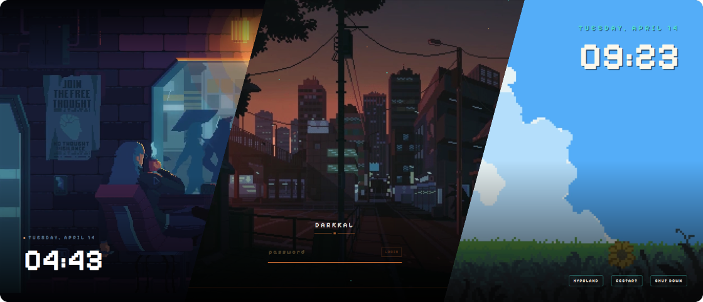

<p align="center">
  
</p>

<p align="center">
  <a href="#sddm"></a>
  <a href="#usage"></a>
  <a href="#installation"></a>
  <a href="#architecture"></a>
  <a href="#license"></a>
</p>

<div align="center">
  <pre>
    <a href="#features">ꜰᴇᴀᴛᴜʀᴇꜱ</a>  •  <a href="#installation">ɪɴꜱᴛᴀʟʟ</a>  •  <a href="#quick-start">ǫᴜɪᴄᴋ ꜱᴛᴀʀᴛ</a>  •  <a href="#usage">ᴜꜱᴀɢᴇ</a>  •  <a href="#configuration">ᴄᴏɴꜰɪɢ</a>  •  <a href="#preview">ᴘʀᴇᴠɪᴇᴡ</a>  •  <a href="#sddm">ꜱᴅᴅᴍ</a>  •  <a href="#docs">ᴅᴏᴄꜱ</a>  •  <a href="#faq">ꜰᴀǫ</a>  •  <a href="#gallery">ɢᴀʟʟᴇʀʏ</a>  •  <a href="#acknowledgements">ᴀᴄᴋɴᴏᴡʟᴇᴅɢᴇᴍᴇɴᴛꜱ</a>
  </pre>
</div>

<br>

<p>Welcome to <b>Darwan</b>! It's one app, with a CLI, a TUI and a GUI, for choosing, configuring, previewing and applying a collection of hand-crafted themes to both of your gates:</p>

- **the login screen**, through SDDM
- **the lockscreen**, through Quickshell

> [!NOTE]
> **What's in the name?**
> **Darwan** (দারোয়ান, said *dar-waan*) is Bangla for *gatekeeper*: the guard who sits by the gate, checks who's coming
in and politely sends everyone else away. This app does that job at both of your computer's gates.

<br>
<p align="center">━━━━━━━ ❖ ━━━━━━━</p>

<a id="features"></a>
<br>

<p align="center">
  
</p>

<br>

- **One app, three faces.** `darwan` (CLI), `darwan` with no arguments (TUI) and `darwan-gui` (a Qt GUI) all share the
  same core, so they behave identically.
- **One config file.** `~/.config/darwan/config.toml` holds everything. Nothing inside the theme folders is ever edited.
- **Separate lockscreen and login themes.** Use Orbital for the lock and Rainy Room for SDDM if you like.
- **Options that know the theme.** Each theme declares what it supports. Options a theme can't use are shown disabled
  with the reason, and options that depend on another option unlock when it's set.
- **Test without locking yourself out.** A live preview in the GUI, a full-screen preview with a mock password, a
  preview through SDDM's own greeter, and headless checks that load every theme and type the password to make sure it
  unlocks.
- **Safe SDDM setup.** A small helper does the root-only work through polkit and checks every value again; nothing else
  runs as root.
- **Never locked out.** If a theme fails to load, Darwan shows a plain fallback password prompt instead of a black
  screen.
- **Global settings.** 12h/24h clock, AM/PM and a date format apply to every theme that supports them. Left unset, each
  theme keeps its own design.

<br>
<p align="center">━━━━━━━ ❖ ━━━━━━━</p>

<a id="installation"></a>
<br>

<p align="center">
  
</p>

<br>

> [!NOTE]
> Darwan supports **Arch Linux only**, with Qt6 SDDM and Quickshell on Wayland.

#### 📦 DEPENDENCIES

Your AUR helper or `makepkg -s` installs these for you.

|                           | Packages                                                                                                                            |
|--------------------------:|:------------------------------------------------------------------------------------------------------------------------------------|
|              **Required** | `quickshell` `qt6-base` `qt6-declarative` `qt6-imageformats` `qt6-svg` `qt6-5compat` `qt6-multimedia` `qt6-multimedia-ffmpeg` `mpvqt` `polkit` `ttf-jetbrains-mono-nerd` |
|              **Optional** | `sddm` (the login screen) · `hypridle` (the screensaver) · `libfaketime` (`darwan preview --at`) · `noto-fonts-cjk` (Chinese text in Genshin Impact) |
| **Build** (`darwan` only) | `rust` `lld` `librsvg` `cmake` `qt6-shadertools` |

#### 🚀 INSTALL

Darwan is in the AUR as two packages. Install **one** of them:

| Package      | What you get                                                   |
|:-------------|:---------------------------------------------------------------|
| `darwan-bin` | the prebuilt release; installs in seconds (**recommended**)    |
| `darwan`     | the same release, compiled on your machine; takes a few minutes |

With [`paru`](https://aur.archlinux.org/packages/paru):

```sh
paru -S darwan-bin
```

With [`yay`](https://aur.archlinux.org/packages/yay):

```sh
yay -S darwan-bin
```

To compile it yourself, use `darwan` instead of `darwan-bin` in either command.

Without an AUR helper:

```sh
git clone https://aur.archlinux.org/darwan-bin.git
cd darwan-bin
makepkg -si
```

The package installs:

| Path                                            | What                                                      |
|:------------------------------------------------|:----------------------------------------------------------|
| `/usr/bin/darwan`                               | CLI + TUI                                                 |
| `/usr/bin/darwan-gui`                           | GUI, also in your app launcher as *Darwan*                |
| `/usr/lib/darwan/darwan-helper`                 | privileged SDDM helper, run through `pkexec`              |
| `/usr/lib/darwan/qml/Darwan/`                   | the QML plugin that plays videos (libmpv) and wakes the screensaver |
| `/usr/share/darwan/runtime/`                    | the QML runtime shared by the lockscreen and the previews |
| `/usr/share/darwan/themes/`                     | all 40 themes                                             |
| `/usr/share/polkit-1/actions/org.darwan.policy` | lets the helper ask for your password once per session    |
| `/usr/share/applications/darwan.desktop`        | the *Darwan* launcher entry                               |
| `/usr/share/icons/hicolor/*/apps/darwan.*`      | its icon, as SVG and as PNGs from 16 to 512 px            |

To build from this repository instead, see [Development](./docs/development.md).

#### 🗑️ UNINSTALL

If you applied a theme to the login screen, undo that first. It removes the files Darwan's helper wrote, which pacman
doesn't track:

```sh
darwan sddm reset
```

Then remove the package (`darwan` if you installed that one):

```sh
sudo pacman -R darwan-bin
```

Your settings stay in `~/.config/darwan/`; delete that folder too if you want them gone.

<br>
<p align="center">━━━━━━━ ❖ ━━━━━━━</p>

<a id="quick-start"></a>
<br>

<p align="center">
  
</p>

<br>

From a fresh install to both screens themed, in six steps. `pixel-coffee` is just an example; `darwan list` shows every
theme's id.

**1. Check your system.** Anything missing is listed with a fix:

```sh
darwan doctor
```

**2. Browse the themes.** Open *Darwan* from your app launcher, or the GUI from a terminal:

```sh
darwan-gui
```

Prefer the terminal? The TUI has the same themes and settings:

```sh
darwan
```

**3. Try one full screen.** Nothing is locked; type `test` to unlock, or press `Ctrl+Q` to close:

```sh
darwan preview pixel-coffee
```

**4. Use it for your lockscreen.** Choose the theme:

```sh
darwan set lock.theme pixel-coffee
```

Then bind a key to `darwan lock` (see [Lockscreen keybind](#lockscreen-keybind)) and try it; unlock with your real
password:

```sh
darwan lock
```

**5. Use it on the login screen.** See it in SDDM's own greeter first:

```sh
darwan sddm preview pixel-coffee
```

Then apply it. This asks for your password, because it writes system files:

```sh
darwan sddm apply pixel-coffee
```

Log out to see it. To go back to your previous login screen:

```sh
darwan sddm reset
```

**6. Add missing fonts (optional).** Eight themes use commercial fonts that can't be shipped; see [Fonts](#fonts).

<a id="usage"></a>
<br>

<p align="center">
  
</p>

<br>

#### ⌨️ CLI

| Command                                                   | What it does                                                                      |
|:----------------------------------------------------------|:----------------------------------------------------------------------------------|
| `darwan`                                                  | open the TUI                                                                      |
| `darwan list`                                             | list the themes; `L` marks the lock theme, `S` the SDDM theme                     |
| `darwan show <theme>`                                     | a theme's details, fonts and settings                                             |
| `darwan get [key]` · `set <key> <value>` · `unset <key>`  | read, change or reset a setting, e.g. `darwan set clock.format 12h`               |
| `darwan unset <theme>`                                    | put every setting of one theme back to its default                                |
| `darwan lock [theme]`                                     | lock the screen now (default: the `[lock]` theme)                                 |
| `darwan preview [theme]`                                  | full-screen preview, no real lock ([details](#preview))                           |
| `darwan check <theme>… \| --all`                          | headless test: QML errors, missing fonts, and whether typing the password unlocks |
| `darwan sddm apply` · `preview` · `status` · `reset`      | manage the login screen ([details](#sddm))                                        |
| `darwan font import <theme> <file>`                       | install a licensed font a theme needs                                             |
| `darwan wallpaper set <file> [-o DP-1]`                   | set the desktop wallpaper through whatever draws it ([details](#wallpapers))      |
| `darwan wallpaper status` · `list` · `prepare` · `online` | what draws it; your folder; thumbnails ahead of time; browse and download online  |
| `darwan doctor`                                           | check the session, Quickshell, fonts, the helper and SDDM's config                |
| `darwan completion bash\|zsh\|fish`                       | print the tab-completion script for your shell                                    |

Setting keys are `lock.theme`, `sddm.theme`, `clock.format`, `clock.show_ampm`, `date.format`, the screensaver's
`saver.*`, the wallpaper page's `wallpaper.*` ([details](#wallpapers)) and `<theme>.<option>`.

Tab completion offers theme ids, setting keys and each key's values. Load it when your shell starts, so it stays in step
with the installed version:

```sh
echo 'source <(darwan completion zsh)' >> ~/.zshrc          # zsh
echo 'source <(darwan completion bash)' >> ~/.bashrc        # bash
echo 'darwan completion fish | source' >> ~/.config/fish/config.fish  # fish
```

#### 🖥️ TUI

Run `darwan` in a terminal. Themes are grouped into Clockwork, Pixel and Other themes, with a still preview of the
selected one (kitty, sixel or iTerm graphics, falling back to block characters). Keys that can't work on your system are
greyed out and say why.

| Key       | Action                         | Key       | Action                       |
|:----------|:-------------------------------|:----------|:-----------------------------|
| `⏎` · `→` | settings for the theme         | `/`       | search by name or id         |
| `p`       | preview as the lockscreen      | `P`       | preview with the SDDM layout |
| `l`       | use as the lock theme          | `L`       | lock now                     |
| `s`       | apply to the SDDM login screen | `S`       | preview in SDDM's test mode  |
| `f`       | import a missing font          | `c`       | check the theme              |
| `d`       | doctor                         | `?` · `q` | all keys · quit              |

#### 🎨 GUI

Run `darwan-gui`, or open *Darwan* from your launcher.

- **The start screen** opens on your lockscreen theme, filling the window behind its name, with *Customise* and
  *Lock now*; the strip under it features your login screen instead (with *Test*), and hovering a gate there plays its
  unlock. Under them, every theme as a card: hover one (or move to it with the arrow keys) to watch it unlock; the
  chips above filter by family, video backgrounds, themes that bring their own font, or the ones in use. `Ctrl+F`
  searches. The screensaver's settings are under ⚙ → *Screensaver*.
- **Open a theme** and it fills the window, live: click it and type `test` to unlock. `←` `→` step through the themes
  (or hover near the bottom for a strip of them), *Lockscreen* / *Login screen* shows it as each host would, and the
  bars step aside while you look. At the bottom: *Try* (full-screen, screensaver, SDDM's own greeter, lock now),
  *Check*, *Compare changes* once you've changed it (hold it, or `\`, to see it as it ships) and *Use as…*, which puts
  it on the lockscreen, the login screen or both. `Esc` goes back.
- **The settings** sit beside it (`Ctrl+I` hides them): *This theme* for its background, look, colours, fonts and
  motion, *All themes* for the clock and date. The preview shows every change at once; nothing is written until
  *Save* (`Ctrl+S`), and *Discard* takes it all back. Drop an image or video on the preview to use it as the
  background.
- **Wallpapers**: *Home*, *Explore* and *Library* in the pill at the top show your wallpaper folder and free
  wallpapers online; open one and *Set Wallpaper* ([details](#wallpapers)).
- **⚙** holds the look (*Darwan*'s own, the default, or your *System* Qt theme's colours and font, `gui.look`, saved
  as you pick), the clock and date, and the screensaver. **Doctor** at the top turns amber when
  something needs a look; click it for the full check.

<a id="lockscreen-keybind"></a>

#### 🔒 LOCKSCREEN KEYBIND

*Use as… → Lockscreen* only chooses the theme. To lock with Darwan, point your lock keybind and idle locker at
`darwan lock`, and let a new locker take over if one ever crashes. In Hyprland's Lua config:

```lua
hl.config({ misc = { allow_session_lock_restore = true } })
hl.bind("SUPER + L", hl.dsp.exec_cmd("darwan lock"), { desc = "Lock" })
```

or in a classic `hyprland.conf`:

```ini
misc {
    allow_session_lock_restore = true
}
bind = SUPER, L, exec, darwan lock
```

For hypridle, lock with Darwan and let sleep wait until the lock is up:

```ini
general {
    lock_cmd = darwan lock
    before_sleep_cmd = loginctl lock-session
    inhibit_sleep = 3
}
```

`inhibit_sleep = 3` matters: hypridle's default waits for the lock only when the command is hyprlock, so without it the
machine can go to sleep before Darwan's lock is on screen. `darwan doctor` checks this.

Pressing the keybind while already locked does nothing, because only one lockscreen runs at a time, and `darwan lock`
refuses to lock while `allow_session_lock_restore` is off. If the lockscreen crashes, for example when a monitor drops
out during sleep, Darwan starts a new one by itself and it takes the lock back.

<a id="screensaver"></a>

#### 🌙 SCREENSAVER

Every theme doubles as a screensaver: when you're idle, your lock theme fades in over the desktop with only its
background and its animation (rain, drifting ash, a turning dial), no clock or password field. Any key or click brings
the lock's widgets in (the first key you type goes straight into the password field), or, if the screensaver hasn't
locked yet, fades it away to your desktop. A revealed lock, including one you locked yourself, settles back to the
screensaver after 30 seconds without input (`saver.return_after`). On Hyprland, a lock nobody touches turns the
screens off after 5 minutes (`saver.screen_off_locked`), counted from the lock and from every touch, whether you locked
by hand or the screensaver did; any key or mouse move turns them back on.

hypridle starts it. In the GUI, ⚙ → *Screensaver* sets it up: it says whether hypridle is installed and running (and
how to start it with your session), writes `~/.config/hypr/hypridle.conf` for you when you save, and shows the idle,
lock, screen-off and suspend times as a timeline you can change. By hand, the setup it writes is:

```ini
general {
    lock_cmd = darwan lock
    before_sleep_cmd = loginctl lock-session
    after_sleep_cmd = darwan resumed; hyprctl dispatch 'hl.dsp.dpms({ action = "on" })'
    inhibit_sleep = 3
}

listener {
    timeout = 300
    on-timeout = darwan saver
}

listener {
    timeout = 600
    on-timeout = hyprctl dispatch 'hl.dsp.dpms({ action = "off" })'
    on-resume = hyprctl dispatch 'hl.dsp.dpms({ action = "on" })'
}
```

(With a classic `hyprland.conf`, the screen commands are `hyprctl dispatch dpms off` and `dpms on`.) Start hypridle
with `systemctl --user enable --now hypridle.service` under uwsm, or from Hyprland's config otherwise. When the
screensaver's timeout comes round while a woken lock sits unused, it goes back to the screensaver and forgets a
half-typed password. With several monitors, what you type shows on every one.

Darwan notices the outputs powering off by itself. With the outputs off, an
unlocked screensaver ends (waking shows the desktop) and a locked one drops its theme to a black lock (waking shows the
password prompt). Waking from sleep never shows the screensaver either.

| Setting                   | Values                            | Default | Does                                                                                                             |
|:--------------------------|:----------------------------------|:--------|:-----------------------------------------------------------------------------------------------------------------|
| `saver.lock_after`        | seconds, or `never`               | `10`    | how long the screensaver waits before it locks; `0` locks as it appears                                          |
| `saver.return_after`      | seconds, `5` or more              | `30`    | how long a lock left untouched keeps its widgets before the screensaver comes back; not while something is typed |
| `saver.screen_off_locked` | seconds, `10` or more, or `never` | `300`   | how long a lock left untouched keeps the screens on (Hyprland)                                                   |
| `saver.quality`           | `full` `auto` `eco` `still`       | `full`  | what videos play: as shipped, chosen for you, at up to 1080p and 30 fps, or a still frame                        |

`full` plays every video as shipped, on every monitor: the smoothest, and the most GPU work, power and memory. `auto`
picks from your hardware and power: full video on a dedicated GPU with a decoder; the smaller copies on integrated
graphics, on battery, without a video decoder driver or with less than 8 GB of memory; stills with the power-saver
profile or without a GPU. The smaller copies are made once, in the background, when you pick a theme or a background.
Except with `full`, only the focused monitor plays video (the others show its first frame). All three are also in
the GUI's screensaver settings, and `darwan doctor` shows what was chosen and why.

Try it without waiting: `darwan preview <theme> --saver` (or *Screensaver preview* in the GUI, `a` in the TUI).

<a id="wallpapers"></a>

#### 🖼️ WALLPAPERS

Darwan sets your desktop wallpaper through whatever already draws it, so nothing new runs and your setup keeps
working: your shell (DMS, Noctalia, Caelestia, Omarchy), your desktop's own background (KDE Plasma, GNOME, Cinnamon,
MATE, Xfce), sway, waypaper when its backend is what runs, or the wallpaper tool itself (hyprpaper, awww/swww,
wpaperd, mpvpaper, gSlapper, swaybg, wbg). It checks the result by asking that tool what it shows, and says so plainly
when something can't be done, e.g. a video with a tool that shows pictures only.

- **Home** features one of your wallpapers at full size, with a strip of others and rows from each online source.
- **Library** is your wallpaper folder and its subfolders, four levels down: by default `Wallpapers` (or
  `wallpapers`) in your Pictures folder, however your system names that. Thumbnails go to the shared
  `$XDG_CACHE_HOME/thumbnails` (`~/.cache/thumbnails`), so your file manager and Darwan make each one once, and every
  picture's colours are kept too, for the colour chips. **+** adds pictures to it.
- **Explore** mixes Wallhaven (searchable), Bing's image of the day, NASA's Astronomy Picture of the Day and Wikimedia
  Commons' featured pictures; the source chips narrow it to one. No account or key. The first 50 load at once, then
  25 more as you scroll. Pictures and responses are cached under `$XDG_CACHE_HOME/darwan`, so a second visit is quick.
  A picture you set is downloaded into your folder with its credit (author, licence, source page), shown with it,
  and marked DOWNLOADED from then on.
- **Sexual content in any form is never shown**, from any source; there is no switch for it. People and portraits,
  anime and manga, games, films and TV, war and weapons, gore and violence, and horror stay hidden until you allow
  them under *Filter* (or with `wallpaper.allow`). Wallhaven pictures appear one by one, as each one's own tags pass
  these checks.
- **Set Wallpaper** asks which display when you have several and your tool can give each its own. Afterwards,
  *Use on lockscreen too* makes your lock theme show your desktop wallpaper.
- **Colours.** A shell that makes your colours from the wallpaper does so as usual, because Darwan sets it through
  the shell. With a plain wallpaper tool, *Colours* runs matugen, pywal, wallust or hellwal after each change, if you
  use one.
- **Tools that must be restarted** (swaybg, and mpvpaper or gSlapper without their control socket) are restarted only
  after you say so, once or for good; one that systemd runs is never restarted behind its back.

| Setting             | Values                                                        | Default                  |
|:--------------------|:--------------------------------------------------------------|:-------------------------|
| `wallpaper.folder`  | an absolute path, or one starting with `~/`                   | `~/Pictures/Wallpapers`  |
| `wallpaper.allow`   | any of `people` `anime` `games` `series` `war` `gore` `horror` | none                     |
| `wallpaper.restart` | any of `swaybg` `mpvpaper` `gSlapper` `wbg`                   | none: Darwan asks        |
| `wallpaper.colours` | any of `matugen` `pywal` `wallust` `hellwal`                  | none                     |

From a terminal: `darwan wallpaper set <file>` (add `-o DP-1` for one screen), `darwan wallpaper status`,
`darwan wallpaper online bing` (or `wallhaven lake`, `apod`, `commons --topic space`) with `--download 3 --set`.

<a id="desktop-shells"></a>

#### 🧩 DESKTOP SHELLS

Most Hyprland shells bring a lockscreen of their own. A lock starts from your keybind, from idle, or before sleep, and
`loginctl lock-session` (which many power menus call) asks whoever listens for it. Send all of these to
`darwan lock` and turn the shell's own lock off: Hyprland allows one lockscreen at a time, so when two answer, one
fails. The [website](https://darwan.dev/docs/shells) has the full walk-through. For the [screensaver](#screensaver),
let hypridle own idle: give it the `darwan saver` listener and turn the shell's idle lock off, or both will fire.

| Shell                     | Its lockscreen                | What changes                                                | Login screen              |
|:--------------------------|:------------------------------|:------------------------------------------------------------|:--------------------------|
| DankMaterialShell         | its own                       | one setting                                                 | dank-greeter (greetd)     |
| Noctalia 5                | its own                       | turn it off; idle in Noctalia; sleep in hypridle; a keybind | noctalia-greeter (greetd) |
| Caelestia                 | its own                       | keybind, idle and sleep settings; sleep in hypridle         | none shipped              |
| illogical-impulse (end-4) | its own, started by hypridle  | `lock_cmd` in hypridle                                      | none shipped              |
| Omarchy 4                 | the Omarchy shell's           | keybind; idle and sleep to hypridle                         | SDDM, autologin           |
| Omarchy 3                 | hyprlock, started by hypridle | hypridle and keybind                                        | SDDM, autologin           |

**DankMaterialShell.** *Settings → Power & Sleep → Custom commands → Lock*: `darwan lock` (or
`"customPowerActionLock": "darwan lock"` in `~/.config/DankMaterialShell/settings.json`). The lock keybind, idle lock,
power menu and `loginctl lock-session` then all run Darwan. Keep *Lock before suspend* on: DMS locks through the same
command and holds sleep for up to 4 seconds. Don't also give hypridle a `lock_cmd`.

**Noctalia 5.** In `~/.config/noctalia/*.toml` (or *Settings → Security → Lock Screen*):

```toml
[lockscreen]
enabled = false

[idle.behavior.lock]
timeout = 600
action = "command"
command = "darwan lock"
enabled = true
```

Bind a key to `darwan lock`, and let hypridle lock before sleep with the `general` block shown above.

**Caelestia** shows its own lock on every `loginctl lock-session`, with no setting to stop it, so call Darwan directly.
In `~/.config/caelestia/hypr-vars.lua` set `kbLock = ""` and `kbRestoreLock = ""`, and bind `darwan lock` in
`hypr-user.lua`. In `~/.config/caelestia/shell.json` set `general.idle.lockBeforeSleep` to `false` and make the idle
lock `"idleAction": ["darwan", "lock"]`. For sleep, hypridle with only:

```ini
general {
    before_sleep_cmd = darwan lock --for-sleep
    inhibit_sleep = 3
}
```

`--for-sleep` locks with a black screen at once and loads the theme after wake.

**illogical-impulse** sends every lock through hypridle. In `~/.config/hypr/hypridle.conf`, set the `general` block to
the one above (`lock_cmd = darwan lock`, dropping `after_sleep_cmd`), and restart hypridle.

**Omarchy 4** keeps its lockscreen in its shell. Rebind in `~/.config/hypr/bindings.lua`:

```lua
hl.unbind("SUPER + CTRL + L")
o.bind("SUPER + CTRL + L", "Lock system", "darwan lock")
```

then turn off its idle lock and sleep lock, and give both to hypridle (install it; Omarchy 4 doesn't ship it) with the
`general` block above, plus a `listener` that runs `loginctl lock-session` after 300 seconds:

```sh
omarchy toggle idle stay-awake
systemctl --user mask --now omarchy-sleep-lock.service
```

**Omarchy 3.** In `~/.config/hypr/hypridle.conf`, use the `general` block above and replace `omarchy-system-lock` in
the listeners with `loginctl lock-session` (keep the screensaver from starting behind the lock with
`pgrep -f '[d]arwan lock-supervisor' || omarchy-launch-screensaver`). In `~/.config/hypr/bindings.conf`:
`unbind = SUPER CTRL, L` and `bindd = SUPER CTRL, L, Lock system, exec, darwan lock`. `omarchy-refresh-hypridle`
undoes the hypridle change.

**Starting hypridle.** Under uwsm, `systemctl --user enable --now hypridle.service`; otherwise start it from Hyprland
(`hl.on("hyprland.start", function() hl.exec_cmd("hypridle") end)`, or `exec-once = hypridle`).

**Login screen.** Darwan's login-screen themes need SDDM. Coming from greetd (DMS's and Noctalia's greeters):
`sudo systemctl disable greetd.service && sudo systemctl enable sddm.service`, then `darwan sddm apply`. On Omarchy,
`darwan sddm apply` wins over Omarchy's theme (`zz-darwan.conf` is read after its `10-theme.conf`), but Omarchy logs
you in automatically, so you see the login screen after logging out, or at every boot once
`/etc/sddm.conf.d/autologin.conf` is gone.

Check the result with `darwan doctor`, then try the keybind, `loginctl lock-session`, idle and a suspend: each should
show your Darwan theme, never the shell's own lockscreen.

<br>
<p align="center">━━━━━━━ ❖ ━━━━━━━</p>

<a id="configuration"></a>
<br>

<p align="center">
  
</p>

<br>

Everything lives in `~/.config/darwan/config.toml`. The CLI, TUI and GUI all edit this file and keep your comments. You
can also edit it by hand.

```toml
[lock]
theme = "clockwork/orbital"

[sddm]
theme = "pixel-rainyroom"

[clock]
format = "12h"          # "12h" | "24h"; unset, each theme keeps its own
show_ampm = false

[date]
format = "ddd, MMM d"   # one of the presets below; unset, each theme keeps its own

[saver]
lock_after = 10         # seconds from the screensaver to the lock, or "never"; 0 locks at once
return_after = 30       # seconds an untouched lock keeps its widgets before the screensaver comes back; 5 or more
screen_off_locked = 300 # seconds an untouched lock keeps the screens on, or "never"; 10 or more (Hyprland)
quality = "full"        # "full" | "auto" | "eco" | "still"

[gui]
look = "darwan"         # "darwan" | "system" to follow your Qt theme's colours and font

[themes."clockwork/orbital"]
themeMode = "light"
enableWindup = false

[themes.terraria]
background_mode = "static"
background_index = "3"
```

#### 🎛️ PER-THEME OPTIONS

| Theme               | Option                                 | Values                                                      |
|:--------------------|:---------------------------------------|:------------------------------------------------------------|
| Clockwork · Orbital | `themeMode`                            | `dark` `light`                                              |
| Clockwork · Orbital | `enableWindup`                         | `true` `false`                                              |
| Clockwork · Tape    | `themeMode`                            | `dark` `light`                                              |
| osu! / osu! mania   | `gameMode`                             | `menu` (straight to password) · `game` (rhythm-game gate)   |
| Genshin Impact      | `background_mode` · `background_index` | `time` `random` `static` · `1`–`4` (day, night, dawn, dusk) |
| Terraria            | `background_mode` · `background_index` | `time` `random` `static` · `1`–`5`                          |

`darwan show <theme>` always lists the current set.

The clock settings reach the 39 themes that show a clock and the date setting the 38 that show a date: Nine Sols and
Terraria show neither, and osu! has no date. Date presets:

| `date.format`  | Looks like             |
|:---------------|:-----------------------|
| `dddd, MMMM d` | Saturday, September 26 |
| `ddd, MMM d`   | Sat, Sep 26            |
| `d MMMM yyyy`  | 26 September 2026      |
| `yyyy-MM-dd`   | 2026-09-26             |
| `dd/MM/yyyy`   | 26/09/2026             |
| `MM/dd/yyyy`   | 09/26/2026             |

<a id="fonts"></a>

#### 🔤 FONTS

Some themes use fonts that can't be bundled for copyright reasons. Until you add them, those themes fall back to a
generic font. Get the font, then use *Import…* in the GUI, `f` in the TUI, or `darwan font import <theme> <file>`. In a
source checkout, drop the file into the theme's `font/` folder instead.

|             Theme | Font              | Filename                | Licence                                  | Get it                                                                          |
|------------------:|:------------------|:------------------------|:-----------------------------------------|:--------------------------------------------------------------------------------|
|    NieR: Automata | FOT-Rodin Pro DB  | `FOT-Rodin Pro DB.otf`  | Commercial (Fontworks)                   | [Adobe Fonts](https://fonts.adobe.com/fonts/fot-rodin-pron)                     |
|          Terraria | Andy Bold         | `Andy Bold.ttf`         | Commercial (Monotype)                    | [MyFonts](https://www.myfonts.com/collections/andy-font-matteson-typographics/) |
|    Genshin Impact | HYWenHei-85W      | `zhcn.ttf`              | Commercial (Hanyi)                       | [Hanyi](https://www.hanyi.com.cn/)                                              |
|             Sword | The Last Shuriken | `The Last Shuriken.ttf` | Free for personal use (Arterfak Project) | [DaFont](https://www.dafont.com/the-last-shuriken.font)                         |
| Honkai: Star Rail | DIN Next          | `font.ttf`              | Commercial (Monotype)                    | —                                                                               |
|              osu! | Torus Regular     | `Torus Regular.otf`     | Commercial (Paulo Goode)                 | [Paulo Goode](https://paulogoode.com/torus/)                                    |
|           Nothing | NDot 55           | `NDot55.otf`            | Nothing brand use only                   | No public release                                                               |

<br>
<p align="center">━━━━━━━ ❖ ━━━━━━━</p>

<a id="preview"></a>
<br>

<p align="center">
  
</p>

<br>

You never have to lock your real session to try a theme.

| Mode                    | How                                  | Password                              | Good for                                                                           |
|:------------------------|:-------------------------------------|:--------------------------------------|:-----------------------------------------------------------------------------------|
| **Live preview**        | GUI, the open theme                  | `test`                                | tweaking settings and seeing the change at once                                    |
| **Full-screen preview** | `darwan preview <theme>`             | `test`, or your real one with `--pam` | the exact lockscreen runtime on every monitor, without locking; `Ctrl+Q` closes it |
| **SDDM preview**        | `darwan sddm preview <theme>`        | — (visual only)                       | how it looks in SDDM's own greeter before applying                                 |
| **Headless check**      | `darwan check --all --shots ./shots` | typed for you                         | QML errors, missing fonts and a real unlock test across every theme                |

Preview flags:

| Flag          | Example                                  | Does                                                    |
|:--------------|:-----------------------------------------|:--------------------------------------------------------|
| `--sddm`      | `darwan preview pixel-coffee --sddm`     | shows the login-screen layout instead of the lockscreen |
| `--pam`       | `darwan preview osu --pam`               | unlocks with your real password instead of `test`       |
| `--at HH:MM`  | `darwan preview nier-automata --at 00:00` | fakes the time of day (needs `libfaketime`)            |
| `--shot FILE` | `darwan preview osu --shot osu.png`      | saves a 1280×720 still once the theme has settled       |

`--at` runs the preview in Qt's own `qml` runner, because Quickshell can't start under libfaketime, so it always uses
the mock password.

<br>
<p align="center">━━━━━━━ ❖ ━━━━━━━</p>

<a id="sddm"></a>
<br>

<p align="center">
  
</p>

<br>

| Command                       | Does                                                                          |
|:------------------------------|:------------------------------------------------------------------------------|
| `darwan sddm preview [theme]` | shows the theme in SDDM's own greeter, in test mode, before you apply it      |
| `darwan sddm apply [theme]`   | uses the theme and its settings on the login screen; asks for your password   |
| `darwan sddm status`          | shows what SDDM will use, and any config file that overrides it               |
| `darwan sddm reset`           | removes everything Darwan added, back to your previous login screen           |

Without a theme id, `preview` and `apply` use the `[sddm]` theme from your config.

The SDDM greeter runs as its own user and can't read your home folder, so `apply` writes system files through
`darwan-helper`. The helper checks every value again before writing, and it only ever touches these files:

| File                                               | Purpose                                     |
|:---------------------------------------------------|:--------------------------------------------|
| `/usr/share/sddm/themes/darwan-<theme>`            | points at the chosen theme                  |
| `/usr/share/darwan/themes/<theme>/theme.conf.user` | your options, in SDDM's own override format |
| `/var/lib/darwan/sddm/media/`                      | copies of your background and font files    |
| `/etc/sddm.conf.d/zz-darwan.conf`                  | `[Theme] Current=darwan-<theme>`            |
| `/usr/share/darwan/themes/<theme>/font/<file>`     | fonts you import                            |

> [!TIP]
> SDDM reads `/etc/sddm.conf.d/` in alphabetical order, and later files win. If another file or `/etc/sddm.conf` also
sets `Current=`, `darwan doctor` will point it out.

<br>
<p align="center">━━━━━━━ ❖ ━━━━━━━</p>

<a id="architecture"></a>
<br>

<p align="center">
  
</p>

<br>

```
crates/darwan-core     Rust library: themes, config, validation, settings forms (no Qt)
crates/darwan          CLI + TUI (clap, ratatui); runs Quickshell for the lock, previews and checks
crates/darwan-gui      GUI (cxx-qt + QML) with the live preview
crates/darwan-helper   root-only SDDM and font writer, launched through pkexec
runtime/               QML: ThemeHost, the SDDM contract, the Quickshell lock/preview/check shells
themes/<id>/           Main.qml, theme.conf, metadata.desktop, darwan.toml, preview.jpg, preview.webp
```

- **Themes stay plain SDDM themes.** They read `config.<key>` exactly as they would under SDDM.
- **One override file for both runtimes.** Darwan resolves your settings into that override format, so the lockscreen
  and the login screen see the same values.
- **Themes describe themselves.** Each theme's `darwan.toml` lists its options (labels, types, choices and what they
  depend on) and which global settings it supports. The TUI and GUI build their forms from it.
- **Writing a theme?** [`docs/theme-contract.md`](./docs/theme-contract.md) lists everything a theme can rely on and the
  rules `darwan check` enforces.

<br>
<p align="center">━━━━━━━ ◈ ━━━━━━━</p>

<a id="docs"></a>
<br>

<p align="center">
  
</p>

<br>

| Guide                                                         | Read it when                                                    |
|:--------------------------------------------------------------|:----------------------------------------------------------------|
| [Lock recovery](./docs/lock-recovery.md)                      | the lockscreen crashed or hung and you need to get back in      |
| [Theme contract](./docs/theme-contract.md)                    | you're writing a theme or porting one from another SDDM setup   |
| [Development](./docs/development.md)                          | you're building from source or running the tests                |
| [darwan-assets](https://github.com/mah3uz/darwan-assets)      | you want the demo animations or to re-record them               |

<br>
<p align="center">━━━━━━━ ❖ ━━━━━━━</p>

<a id="faq"></a>
<br>

<p align="center">
  
</p>

<br>

#### 🔓 A theme broke and I'm stuck on the lockscreen?

Darwan shows its fallback password prompt when a theme fails to load. If the locker itself crashes, switch to a text
console (`Ctrl+Alt+F3`), log in and run `darwan lock --replace`, then switch back and unlock.
[Lock recovery](./docs/lock-recovery.md) covers every case. Afterwards, run `darwan check <theme>` and open an
issue with the output.

<br>

#### ⌨️ Virtual keyboard popping up on the login screen?

Open `/etc/sddm.conf.d/virtualkeyboard.conf` as root and empty `InputMethod`:

```ini
[General]
InputMethod=
```

<br>

#### 📺 Low quality background video?

Videos are compressed to keep the download small. For the full HD/4K version, grab the original from
the [Acknowledgements](#acknowledgements) table, rename it to `bg.mp4` and replace the one in the theme's folder.

<br>

#### ❄️ Lockscreen not working on KDE Plasma?

KWin doesn't support the `ext-session-lock-v1` protocol that the Quickshell lockscreen needs. The SDDM login screen
still works fine on Plasma.

<br>

<p align="center">━━━━━━━ ❖ ━━━━━━━</p>

<a id="gallery"></a>
<br>

<p align="center">
  
</p>

<br>

<div align="center">
  <table>
    <tr>
      <td align="center" width="50%">
        <b>Clockwork · Neo-Orbital</b><br><br>
        
      </td>
      <td align="center" width="50%">
        <b>Clockwork · Orbital</b><br><br>
        
      </td>
    </tr>
    <tr>
      <td align="center" width="50%">
        <b>Clockwork · Tape</b><br><br>
        
      </td>
      <td align="center" width="50%">
        <b>Pixel · Coffee</b><br><br>
        
      </td>
    </tr>
    <tr>
      <td align="center" width="50%">
        <b>Pixel · Cyberpunk</b><br><br>
        
      </td>
      <td align="center" width="50%">
        <b>Pixel · Dusk City</b><br><br>
        
      </td>
    </tr>
    <tr>
      <td align="center" width="50%">
        <b>Pixel · Emerald</b><br><br>
        
      </td>
      <td align="center" width="50%">
        <b>Pixel · Hollow Knight</b><br><br>
        
      </td>
    </tr>
    <tr>
      <td align="center" width="50%">
        <b>Pixel · Munchlax</b><br><br>
        
      </td>
      <td align="center" width="50%">
        <b>Pixel · Night City</b><br><br>
        
      </td>
    </tr>
    <tr>
      <td align="center" width="50%">
        <b>Pixel · Rainy Room</b><br><br>
        
      </td>
      <td align="center" width="50%">
        <b>Pixel · Sakura</b><br><br>
        
      </td>
    </tr>
    <tr>
      <td align="center" width="50%">
        <b>Pixel · Skyscrapers</b><br><br>
        
      </td>
      <td align="center" width="50%">
        <b>Pixel · Waterfall</b><br><br>
        
      </td>
    </tr>
    <tr>
      <td align="center" width="50%">
        <b>Dog Samurai</b><br><br>
        
      </td>
      <td align="center" width="50%">
        <b>Enfield</b><br><br>
        
      </td>
    </tr>
    <tr>
      <td align="center" width="50%">
        <b>Field</b><br><br>
        
      </td>
      <td align="center" width="50%">
        <b>Forest</b><br><br>
        
      </td>
    </tr>
    <tr>
      <td align="center" width="50%">
        <b>Genshin Impact</b><br><br>
        
      </td>
      <td align="center" width="50%">
        <b>Girl · Coffee</b><br><br>
        
      </td>
    </tr>
    <tr>
      <td align="center" width="50%">
        <b>Girl · Pillow</b><br><br>
        
      </td>
      <td align="center" width="50%">
        <b>Honkai: Star Rail</b><br><br>
        
      </td>
    </tr>
    <tr>
      <td align="center" width="50%">
        <b>Man · Bicycle</b><br><br>
        
      </td>
      <td align="center" width="50%">
        <b>Material You</b><br><br>
        
      </td>
    </tr>
    <tr>
      <td align="center" width="50%">
        <b>Material You · dark variant</b><br><br>
        
      </td>
      <td align="center" width="50%">
        <b>Minecraft</b><br><br>
        
      </td>
    </tr>
    <tr>
      <td align="center" width="50%">
        <b>NieR: Automata</b><br><br>
        
      </td>
      <td align="center" width="50%">
        <b>Nine Sols</b><br><br>
        
      </td>
    </tr>
    <tr>
      <td align="center" width="50%">
        <b>Ninja Gaiden</b><br><br>
        
      </td>
      <td align="center" width="50%">
        <b>Nothing</b><br><br>
        
      </td>
    </tr>
    <tr>
      <td align="center" width="50%">
        <b>osu!</b><br><br>
        
      </td>
      <td align="center" width="50%">
        <b>osu! mania</b><br><br>
        
      </td>
    </tr>
    <tr>
      <td align="center" width="50%">
        <b>Reverse: 1999 - I</b><br><br>
        
      </td>
      <td align="center" width="50%">
        <b>Reverse: 1999 - II</b><br><br>
        
      </td>
    </tr>
    <tr>
      <td align="center" width="50%">
        <b>Sword</b><br><br>
        
      </td>
      <td align="center" width="50%">
        <b>Terraria</b><br><br>
        
      </td>
    </tr>
    <tr>
      <td align="center" width="50%">
        <b>The Last of Us</b><br><br>
        
      </td>
      <td align="center" width="50%">
        <b>Windows 7</b><br><br>
        
      </td>
    </tr>
    <tr>
      <td align="center" width="50%">
        <b>Winter</b><br><br>
        
      </td>
      <td align="center" width="50%">
        <b>Women · Umbrella</b><br><br>
        
      </td>
    </tr>
    <tr>
      <td align="center" width="50%">
        <b>Wuthering Waves</b><br><br>
        
      </td>
      <td width="50%"></td>
    </tr>
  </table>
</div>

<br>

<p align="center">━━━━━━━ ❖ ━━━━━━━</p>

<a id="acknowledgements"></a>
<br>

<p align="center">
  
</p>

<br>

> [!IMPORTANT]
> ### 💜 Built on qylock
> Darwan would not exist without **[qylock](https://github.com/Darkkal44/qylock)** by
**[Darkkal44](https://github.com/Darkkal44)**.
>
> Every theme in this collection was designed and built there: the pixel worlds, the game tributes, Clockwork, and the
SDDM/Quickshell shim that made one theme run in both places. Darwan only builds an app around that work. The hard,
creative part is theirs.
>
> Thank you, Darkkal, and thank you to everyone who helped qylock grow:
> - the contributors
> - supporters **Max**, **Awkward**, **Chương Kính**, **MerhawiGhebrekal**, **Silenett**, **wawzi**, **franchecol** and
    **Trench Martyr**
> - special thanks to **Pumphium**, **kaizky** and **DragonChicken**
>
> If you enjoy these themes, please ⭐ [star qylock](https://github.com/Darkkal44/qylock)
and [support Darkkal on Ko-fi](https://ko-fi.com/darkkal).

<br>

Huge thanks to all the amazing artists for these wallpapers and fonts! Here's where everything comes from:

| Theme                     | Wallpaper                                                                                                                | Font              | Theme                  | Wallpaper                                                                                                                                                                                | Font          |
|:--------------------------|:-------------------------------------------------------------------------------------------------------------------------|:------------------|:-----------------------|:-----------------------------------------------------------------------------------------------------------------------------------------------------------------------------------------|:--------------|
| **Pixel · Coffee**        | [MoeWalls](https://moewalls.com/pixel-art/cyberpunk-coffee-pixel-live-wallpaper/)                                        | Pixelify Sans     | **Pixel · Munchlax**   | [MoeWalls](https://moewalls.com/pixel-art/munchlax-sleeping-on-the-field-pixel-live-wallpaper/)                                                                                          | Pixelify Sans |
| **Pixel · Dusk City**     | [WallsFlow](https://wallsflow.com/live-wallpapers/pixel-art/505-pixel-dusk-city-retro-anime-streets-live-wallpaper.html) | Pixelify Sans     | **Pixel · Night City** | [WallsFlow](https://wallsflow.com/live-wallpapers/pixel-art/400-night-city-pixel-art-cyberpunk-live-wallpaper.html)                                                                      | Pixelify Sans |
| **Pixel · Hollow Knight** | [MoeWalls](https://moewalls.com/pixel-art/hollow-knight-3-live-wallpaper/)                                               | Pixelify Sans     | **Pixel · Rainy Room** | [MoeWalls](https://moewalls.com/pixel-art/pixel-room-rainy-night-live-wallpaper/)                                                                                                        | Pixelify Sans |
| **Pixel · Skyscrapers**   | [WallsFlow](https://wallsflow.com/live-wallpapers/pixel-art/61-pixel-city.html)                                          | Pixelify Sans     | **Pixel · Cyberpunk**  | [Pixiv](https://www.pixiv.net/en/artworks/84120766)                                                                                                                                      | Pixelify Sans |
| **Pixel · Emerald**       | -                                                                                                                        | Pixelify Sans     | **Pixel · Sakura**     | -                                                                                                                                                                                        | Pixelify Sans |
| **Pixel · Waterfall**     | -                                                                                                                        | Pixelify Sans     | **Enfield**            | [WallsFlow](https://wallsflow.com/live-wallpapers/games/777-arknights-endfield-sakura-sanctuary-live-wallpaper.html)                                                                     | Orbitron      |
| **Sword**                 | [WallsFlow](https://wallsflow.com/live-wallpapers/anime/761-silent-katana-forest-samurai-live-wallpaper.html)            | The Last Shuriken | **The Last of Us**     | [MoeWalls](https://moewalls.com/games/the-last-of-us-sunset-live-wallpaper/)                                                                                                             | Outfit        |
| **Field**                 | [MoeWalls](https://moewalls.com/anime/fading-away-live-wallpaper/)                                                       | -                 | **Girl · Coffee**      | [MoeWalls](https://moewalls.com/anime/chill-afternoon-girl-live-wallpaper/)                                                                                                              | -             |
| **Girl · Pillow**         | [MoeWalls](https://moewalls.com/anime/lazy-afternoon-girl-live-wallpaper/)                                               | Itim              | **Man · Bicycle**      | [MoeWalls](https://moewalls.com/landscape/traveling-with-the-bicycle-live-wallpaper/)                                                                                                    | Itim          |
| **Women · Umbrella**      | [MoeWalls](https://moewalls.com/anime/women-with-umbrella-live-wallpaper/)                                               | Itim              | **Forest**             | [MoeWalls](https://moewalls.com/landscape/in-the-early-morning-forest-live-wallpaper/)                                                                                                   | Figtree       |
| **Winter**                | [MoeWalls](https://moewalls.com/landscape/winter-forest-snow-live-wallpaper/)                                            | Orbitron          | **Dog Samurai**        | [MoeWalls](https://moewalls.com/others/doge-samurai-crying-live-wallpaper/)                                                                                                              | Orbitron      |
| **Honkai: Star Rail**     | [YouTube](https://www.youtube.com/watch?v=Pz7Tu25EyXI)                                                                   | DIN Next          | **Genshin Impact**     | [YouTube](https://www.youtube.com/watch?v=XG3vTgitBLE)                                                                                                                                   | HYWenHei      |
| **Wuthering Waves**       | [YouTube](https://www.youtube.com/watch?v=xKKqi1zLrZ4)                                                                   | Orbitron          | **osu!**               | [Official](https://osu.ppy.sh)                                                                                                                                                           | Torus Regular |
| **osu! mania**            | [Official](https://osu.ppy.sh)                                                                                           | Torus Regular     | **Minecraft**          | [Minecraft Wiki](https://www.google.com/url?sa=t&source=web&rct=j&url=https%3A%2F%2Fminecraft.fandom.com%2Fwiki%2FBackground&ved=0CBkQjhxqFwoTCIC45qWs4pMDFQAAAAAdAAAAABAH&opi=89978449) | Minecraft     |
| **NieR: Automata**        | [Reddit](https://www.reddit.com/r/nier/comments/7nqcy7/the_final_nier_automata_title_screen_made_into/)                  | FOT-Rodin Pro DB  | **Reverse: 1999**      | [Taptap](https://www.taptap.com/topic/21175628)                                                                                                                                          | Outfit        |
| **Clockwork**             | [WallsFlow](https://wallsflow.com/live-wallpapers/abstract/321-clock-mechanism-live-wallpaper.html)                      | Orbitron          | **Terraria**           | [Terraria Forums](https://forums.terraria.org/index.php?threads/terraria-desktop-wallpapers.12644/)                                                                                      | Andy Bold     |
| **Ninja Gaiden**          | [Noisy Pixel](https://noisypixel.net/ninja-gaiden-4-wallpapers-art-team/)                                                | Tektur            | **Windows 7**          | [WallpaperAccess](https://wallpaperaccess.com/windows-7-lock-screen)                                                                                                                     | Segoe UI      |

<br>

<p align="center">━━━━━━━ ❖ ━━━━━━━</p>

<a id="license"></a>
<br>

<p align="center">
  
</p>

<br>

Darwan is licensed under the [GNU GPL v3.0](./LICENSE), the same license as qylock, which it is derived from. Wallpapers
and fonts belong to their respective creators listed above.

<br>
<p align="center">━━━━━━━ ༓ ━━━━━━━</p>

<div align="center">
  <p><i>Make your login your own. The darwan will guard it.</i></p>
</div>
